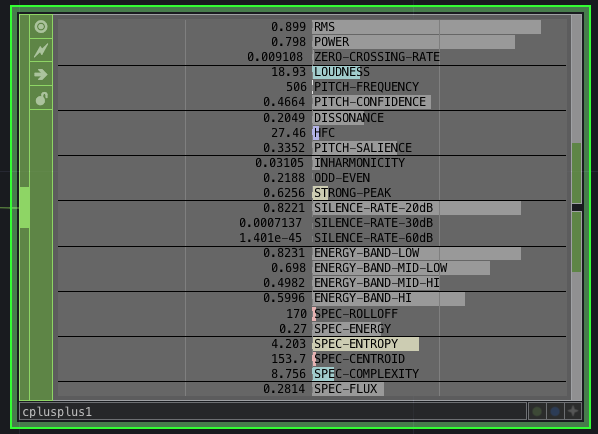
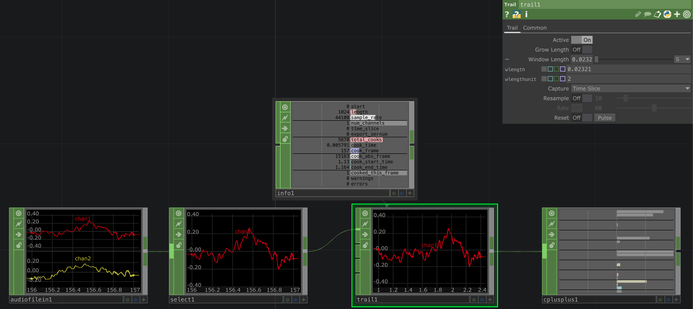

## Audio Analyzer CHOP

TouchDesigner cplusplus Audio Analysis CHOP developed with Essentia library (https://essentia.upf.edu/) 

### Available algorithms

RMS, Power, Zero Crossing Rate, Loudness, Pitch Frequency, Pitch Confidence, Dissonance, High Frequency Content, Pitch Salience, Inharmonicity, Odd-Even, Strong-Peak, Silence Rate, Energy Bands, Spectral Roll Off, Spectral Entropy, Spectral Centroid, Spectral Complexity, Spectral Flux (algorithms reference: https://essentia.upf.edu/algorithms_reference.html)

### Instructions for use

This Chop allows only one channel input. Make sure to pass buffers (num samples) that makes sense for audio processing (1024, 512, etc.).
 For example, if you are using TouchDesigner AudiofileIn or AudiodeviceIn and by default its length is 735 (because of the audio/frame rate syncing. 44100/60 = 735), you can use a trail with a window length of 0.02321 to get a 1024 buffer for analysis.

### Releases and compatibility

The compiled version (.plugin) is only available for Mac, you can find it in this repo as a release.  For Windows usage you can compile it by cloning the repo, and you'll probably have to compile **essentia** and **fftw3** libraries too for Windows

